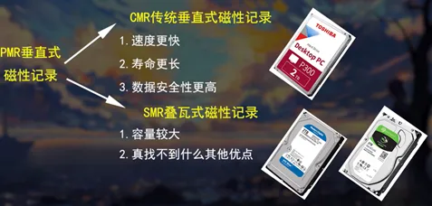

# 衡量指标

IOPS，用来衡量读写次数，而MB/s代表传输速度。

## IOPS概念

IOPS(Input/Output Per Second)即每秒的输入输出量(或读写次数)，是衡量存储介质性能的主要指标之一。

## Throughput

其实日常生活中我们使用个人电脑的时候更多时候感知到的是MB/s，这个衡量单位。

# 磁盘类型

硬盘是一台电脑的数据中心，存放着我们用户的所有文件和数据. 而硬盘的大小决定着我们能存储数据的量. 硬盘的分类有两种：固态硬盘和机械硬盘.

固态硬盘使用闪存颗粒(一种集成块)进行数据存储，通过改变闪存内部的电位来进行数据读写.

机械硬盘则使用一块磁碟进行数据存储通过改变磁碟上的磁极来进行数据的读写，在运行过程中磁碟会高速旋转，而磁头则配合磁碟完成高速读写. 我们日常使用电脑的本质，就是各种数据调用、存储、处理、计算等. 因此硬盘读写速度也在很大程度上影响着电脑的使用体验. 那固态与机械硬盘的优缺点是什么呢？

首先，固态硬盘的读取速度相较于机械硬盘高出很多，有时速度差距甚至会达到10倍以上，并且不会有噪音，但价格也相较于机械硬盘更高. 机械硬盘读写速度慢、噪音大、同时由于它的工作模式，工作时的剧烈晃动可能会给它带来不可逆的损伤，这就要求机械硬盘的工作时必须保持平稳. 虽然它有各种缺点，但它的最大容量及数据安全性和寿命却是固态无法比较的. 这也是工作站在组建nas时会选用大量的机械硬盘的原因.

## 顺序读写与随机读写

对于一块硬盘，它有几个重要指标：顺序读写能力和随机读写能力. 若把硬盘比作一个仓库，硬盘中的数据比作仓库中各种各样的货物. 硬盘的读写比作仓库中一个工人的进货和出货. 这时如果一个工人需要取一个大电冰箱，虽然冰箱很大很重，但是工人却能很快完成，这就是**顺序读写**.

但如果一个工作需要同时取一瓶水，一个文具盒、一包面包、一个鼠标、一管牙膏等，虽然它们很小很轻，但工作必须跑遍整个仓库才能拿到它们. 因此，工人往往会做的更慢，这就是**随机读写**. 应用到日常电脑使用过程中，顺序读写影响到了我们大文件拷贝，随机读写影响到了我们大量小文件的拷贝，换句话说就是打开软件的快慢. 因此随机读写的参数往往比顺序读写的参数来的更重要. 而机械硬盘由于工作原理上的劣势，随机读写能力也就大大弱于固态硬盘. 当然对于市面上正规的固态硬盘，它们的随机读写能力虽然有差异，但如果不是特地去掐秒表计算时间，我们并不会感觉到它们的速度差异. 因此虽然一款固态的商品详情页或许没有随机读写能力说明，我们也不必太过在意.

对于机械硬盘来说，它有两种尺寸：3.5英寸和2.5英寸. 2.5英寸的机械盘常用于笔记本，而3.5英寸机械盘常用台式机，性能也相对更强.

目前机械盘的接口均为一个SATA供电接口(直接电源)，一个SATA数据线接口(通过数据线连接主板)加一个跳线口。机械硬盘通过电源直接供电，并由一根SATA数据线与其他硬件交互数据。

现在市面上机械硬盘的生产技术均为PMR垂直式磁性记录。该技术又分为了两种，CMR垂直式磁性记录和SMR式叠瓦式磁性记录。两者具体技术差别可参考:([【硬件科普】选购机械硬盘的大坑，不看你就上当，详解SMR瓦楞式堆叠硬盘_哔哩哔哩_bilibili](https://link.zhihu.com/?target=https%3A//www.bilibili.com/video/BV1rE411Q71m/%3Fspm_id_from%3D333.337.search-card.all.click%26vd_source%3D7c9614ff853d9d21a525399b28da78be)).

CMR机械硬盘相对于SMR的速度速度更快，寿命更长，数据安全性更高。然而SMR的技术更新，可以将硬盘的容量做的更大。虽然CMR有种种的优点，然而随着现在时代的发展，它又会越来越少。

现在，机械硬盘的三大厂商：西数(蓝盘)、希捷(酷鱼)、东芝(P300)，也仅有东芝P300仍保持CMR技术. 然而也会在将来的一段时间内彻底消失. 而SMR机械硬盘存在种种问题，很多美国用户甚至还集体诉讼过西数数据. 可见两者的差异. 个人也不明白为什么要更换成这种”更先进”的技术. 除此之外，影响机械硬盘读写速度的技术因素基本上没有了. 相同技术(指CMR和SMR)的许多机械硬盘的速度差距都并不会很大.

# 日常使用

大文件拷贝，比如电影文件迁移，更多考虑的是传输速度。

系统调用及游戏加载，更多的考虑随机读写的能力，考虑的是每秒内能读取多少个文件。

IOPS全称为Input/Output Operations Per Second，大意是硬盘每秒的读写次数。一个硬盘的随机读取IOPS主要由其主控和接口决定。在测试硬盘随机读取性能上，大部分软件会使用4KB大小的数据区块作为测试基准。以希捷酷鱼510系列固态硬盘为例，由于其搭载的主控支持NVMe 1.3协议，所以在4KB随机读取上可达到100096 IOPS，写入上也高达896000 IOPS。

参考：https://baijiahao.baidu.com/s?id=1659130139608042360&wfr=spider&for=pc

https://zhuanlan.zhihu.com/p/570003631